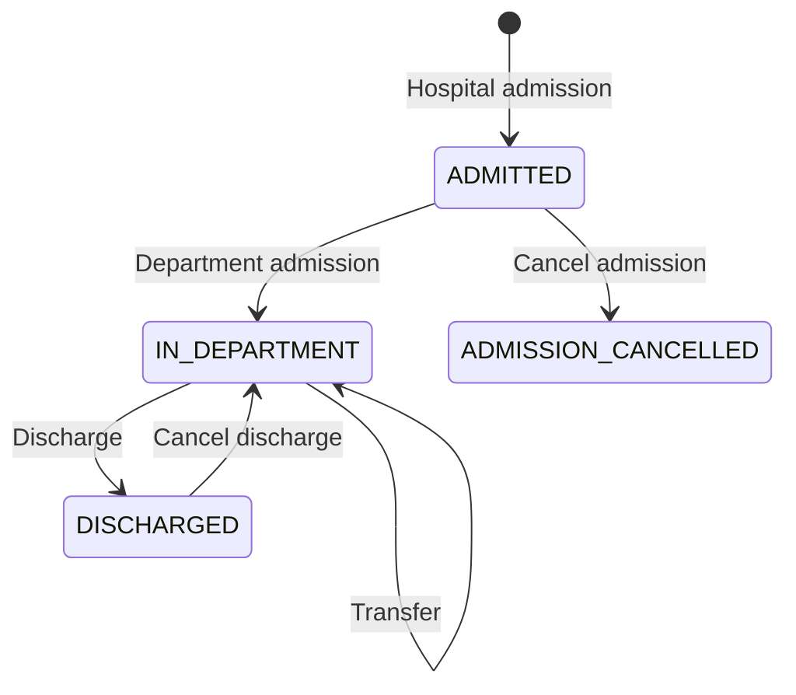

# ClinicFlow API

ClinicFlow is an independent Java backend for inpatient admissions, transfers,
and discharges. It tracks where a patient receives care, whether a bed is
occupied, and how discharge corrections affect that history.

For example, transferring a patient closes the previous location and opens the
next one in a single transaction. Two admissions competing for the same bed
cannot both succeed. Cancelling a mistaken discharge restores care only if the
patient's later encounters and the bed's intervening history allow it.

Built with Java 21, Spring Boot, Spring Security, Spring MVC, Spring Data JPA/Hibernate,
PostgreSQL, and Flyway. H2 supports the local demo and regular tests; JUnit,
Mockito, MockMvc, and Testcontainers cover API and database behaviour.

- [Run the demo](#demo-workflow)
- [Open the patient workbench](#patient-workbench)
- [Use PostgreSQL](#postgresql)
- [API reference and business rules](docs/api.md)
- [Tests and CI](#tests)
- [Current progress and next steps](docs/roadmap.md)
- [Physician assignment rules and delivery status](docs/physician-assignments.md)

## Workflow



Patient registration precedes hospital admission. Department entry records a
department and ward, with an optional bed. Admission cancellation is allowed only
before any location history exists. A genuine readmission creates a new encounter.

## Run locally

Run commands from the repository root with JDK 21. For the complete walkthrough,
use the [demo profile](#demo-workflow). To start with an empty H2 database on
Windows PowerShell:

```powershell
$env:JAVA_HOME = 'C:\Program Files\Java\jdk-21'
$env:Path = "$env:JAVA_HOME\bin;$env:Path"
.\mvnw.cmd spring-boot:run
```

The API starts on port 8080. By default, it uses an in-memory H2 database that is
cleared on shutdown. Default startup does not load reference data, so location
list queries return empty arrays. Department, ward, and bed maintenance endpoints
are not available yet. The physician directory API can use existing departments.

### Sign in

The workbench and business APIs require a signed-in session. Passwords are
encoded with BCrypt. The default and `demo` profiles keep accounts in memory;
the `postgres` profile stores accounts, roles, and password hashes in the database.
User management and password reset endpoints are not implemented yet.
For the default and `demo` profiles, the operator username is `operator` and a
generated development password is printed once during startup unless configured.
That generated password changes on restart.

To choose credentials, set `SPRING_SECURITY_USER_NAME` and
`SPRING_SECURITY_USER_PASSWORD` in the environment of the process starting the
application (or the IDE run configuration). Do not commit credentials. These
settings configure local accounts or initialize a missing PostgreSQL operator.
PostgreSQL startup requires an explicit password when that operator does not
already exist; it never saves a generated development password.
The operator username must be nonblank and at most 100 characters so it fits
the cancellation audit fields; invalid configuration fails at startup.

| Role | Access |
| --- | --- |
| `VIEWER` | Search patients, inpatients, and physicians; view patient records, encounter history, timelines, and location dictionaries. |
| `OPERATOR` | All viewer access, plus registration, admission, department entry, transfer, discharge, and both cancellation workflows. |
| `ADMIN` | Read and maintain the physician directory; read departments for affiliation selection. This role alone does not grant patient or inpatient access. |

To enable a separate read-only account, set `CLINICFLOW_VIEWER_PASSWORD` before
starting the application. Its username defaults to `viewer`; optionally set
`CLINICFLOW_VIEWER_USERNAME`. A nonblank password creates a missing viewer account.
The viewer and operator usernames must differ, ignoring case. In-memory account
configuration changes take effect on restart.

To enable a directory administrator, set `CLINICFLOW_ADMIN_PASSWORD`; the username
defaults to `admin`, with `CLINICFLOW_ADMIN_USERNAME` as an optional override. The
username must differ from other configured accounts, ignoring case. No default
administrator password is supplied and existing operators/viewers are not promoted.
The same provisioning rules below apply to the administrator. Accounts still have
one role each; combined roles and account administration are future work.

Open **Physicians** from the workbench navigation, or visit `/physicians.html`.
Directory administrators land there after sign-in; operators and viewers can
browse physician records but cannot edit them. Administrators can add physicians,
edit names and service departments, and deactivate or reactivate records.
The [physician directory API](docs/api.md#physician-directory) is also available
for Postman or other HTTP clients. Physician-to-encounter assignments are not
implemented yet.

For PostgreSQL, startup only creates missing configured accounts. Existing
passwords, roles, canonical usernames, and enabled states are preserved, even if
the bootstrap environment values change. Removing an optional account's bootstrap
password does not delete that account. After initialization, bootstrap passwords can be removed
from the environment; keep the configured operator username so startup finds the
same account. Changing that username to a new value provisions another operator
and requires an initial password. Reusing an account with a different role fails
startup instead of changing its permissions. Initialization is transactional.
Run initial provisioning with one application instance.

Database usernames are unique ignoring case; successful login returns the stored
username for audit records. Persistent account usernames are limited to 100
characters. Changing bootstrap passwords is not a password-reset mechanism, and
disabling an account prevents new sign-ins without revoking an existing session.

The header shows the signed-in account's access level. Read-only users can open
records and timelines, but do not see editing actions. Those actions also stay
hidden if account permissions cannot be loaded. The API independently rejects
viewer writes with `403`, including requests made outside the workbench. Use the
operator account for the demo workflow script.

Open the workbench, sign in, and use **Sign out** in the header when finished.
Sessions expire after 30 minutes of inactivity and are lost on server restart.
The session cookie is HttpOnly and SameSite=Lax; credentials and session tokens
are not kept in browser storage. Writes, including login and logout, require a
CSRF token. An expired session returns the page to sign-in without retrying a
business write. For HTTPS deployment set `SERVER_SERVLET_SESSION_COOKIE_SECURE=true`.

Admission and discharge cancellations record the authenticated username.
Clients provide the cancellation time, and cannot choose the recorded operator.
See [session API usage](docs/api.md#authentication) for Postman and script access.

### Patient workbench

After starting the application, open [http://localhost:8080/](http://localhost:8080/)
and sign in with the configured account or the generated development password.
If you set another server port, use that port in the browser. Restart the
application after pulling or building changes to the page.

The patient directory supports name or medical record number search, pagination,
registration, and viewing patient details with paginated hospital encounter
history. The history includes cancelled admissions and current encounter states.
A successful registration filters the directory by the new medical record number.
Use **Clear** to return to all patients. The default and demo H2 databases start
without patients and are cleared when the application stops.

Select **Inpatients** in the header to view current hospital stays. Search by
patient name, medical record number, or encounter number; combine status,
current department, and current ward filters with **Apply filters**. The list
includes patients awaiting department entry and patients without a bed. It excludes
discharged and cancelled stays and never matches a previous placement.
Location choices include inactive references so existing care remains searchable.
Use **View record** to open the same patient details and encounter actions used in
the patient directory. Closing the record refreshes the worklist; **Refresh list**
also reloads the applied filters. A removed final row returns to the last available
page. The list is ordered by admission time, then encounter number, oldest first.

To admit a registered patient, open **View record**, select **Admit patient**, and
enter a unique encounter number and an admission time. Time defaults to the current
minute in the browser's local time zone and is sent as a UTC instant. A successful
admission refreshes the encounter history on its first page. Duplicate numbers,
active encounters, and conflicting admission times are shown in the form. If the
save result cannot be confirmed, use **Refresh encounters** to check the record
before retrying; the page does not retry a write automatically.

For an admission recorded in error, select **Cancel admission** in the history
table. This is available only for an **Admitted** encounter with no department
history, including closed placement periods. Review the patient and encounter,
enter the cancellation time, then **Confirm cancellation**.
The time must be on or after admission and no later than now. The patient and
encounter are retained; the stay becomes **Admission cancelled** and leaves the
inpatient list when the patient record closes. **Back** closes without saving.
If a save cannot be confirmed, **Refresh encounter** checks the recorded state
before another attempt. The backend records the signed-in account as the operator.

For an admitted encounter, select **Enter department** in the history table.
Choose an active department and ward, then select an available bed or explicitly
choose **No bed assigned**. Changing wards clears the bed selection. The entry
time must be on or after hospital admission and no later than now. Saving updates
the encounter to **In department** and displays the selected placement.

For an encounter already **In department**, select **Transfer**. Review the current
department, ward, bed, and start time before choosing the destination. Change at
least one of department, ward, or bed. An active current bed can be retained when
only the department changes; **No bed assigned** releases the previous bed.
Transfer time must be on or after the current placement's start and no later than
now. The previous placement ends and the new placement starts at the same instant.

Select **Discharge** for an encounter that is **In department**. Review the current
placement and enter a discharge time on or after that placement's start and no
later than now. Saving closes the hospital stay, ends the current placement, and
releases any assigned bed. The patient record then shows **Discharged** and its
discharge time; transfer and discharge actions are no longer offered for that stay.
If the result cannot be confirmed, select **Refresh encounter** before retrying.
An encounter already discharged is shown with its recorded discharge time.

For a mistaken discharge, select **Cancel discharge** in the patient record.
Review the recorded discharge and the department, ward, and optional bed to restore.
Enter the correction time, then **Confirm cancellation**.
Care continues from the original discharge time; the correction time is retained
separately. The original references must be active, and later hospital stays or
bed use can prevent restoration. The form shows those conflicts and does not
offer a replacement bed. A genuine readmission requires a new encounter.
The page sends the reviewed discharge ID so a later discharge cannot be cancelled
by a stale form. After an unconfirmed save, use **Refresh encounter** to check
whether the correction was recorded. Closing the patient record refreshes the
inpatient list. The timeline shows the signed-in account recorded by the backend.

Select **Timeline** for any encounter, including discharged and cancelled stays.
The view shows admission and cancellation details, department/ward/bed periods,
and discharge records. **Current** identifies an open placement. Cancelled
discharges retain their original time and recorded cancellation operator; restored
care is identified separately from ordinary placement periods. Cancellation time
is the correction's operation time, while care continues from the original
discharge time. Equal-time and zero-duration records remain visible.
Inactive location names are retained. If names cannot be loaded, the recorded
history remains readable with an availability message; use **Refresh timeline**
to retry. Original timestamps are available on the displayed times' tooltips.

Use **Refresh availability** after a conflict or an unconfirmed save. This checks
the encounter again and reloads the location choices; a bed that became occupied
must be reselected. Availability is advisory until the backend saves the entry.
Transfer also checks the current placement before submitting. If a refresh finds
a different placement, review it and select the destination again. A failed or
lost response never triggers an automatic retry of the write.
To try this locally with location choices, start with the `demo` profile described
below. The default empty H2 database has no departments, wards, or beds.

The HTML, CSS, and JavaScript live in `src/main/resources/static` and are packaged
with the Spring Boot application. The page calls the existing REST/JSON
endpoints on the same origin; it needs no separate frontend server or Node build.
After rebuilding and restarting, use **Ctrl+F5** if the browser still shows an older page.
It stores no patient records in browser storage. The core admission, placement,
discharge, correction, and timeline workflows are available from the workbench.

For a browser check, register a fictional patient, search by name, open the record,
and try the same medical record number again to see the duplicate warning. Search
for an unmatched name to check the empty state. With more than 10 patients, select
10 rows per page and use **Next** and **Previous**. Stop the local server and search
to check the retry message, then restart and select **Try again**.

### PostgreSQL

The `postgres` profile stores data in PostgreSQL. Flyway applies versioned SQL
migrations on startup; Hibernate validates the schema without creating or dropping
tables. The default H2 configuration and its tests continue to use Hibernate.

With Docker Desktop running, start the local database in the same terminal used
to run the application:

```powershell
$env:DB_PASSWORD = 'choose-a-local-password'
$env:SPRING_SECURITY_USER_PASSWORD = 'choose-an-initial-operator-password'
docker compose up -d --wait postgres
.\mvnw.cmd '-Dspring-boot.run.profiles=postgres' spring-boot:run
```

The Compose service binds PostgreSQL to localhost port 5432, creates the
`clinicflow` database and user, and stores data in a named volume. Stop it with
`docker compose stop postgres`; restarting the application or database preserves
the data. The password initializes a new volume; changing the environment variable
does not change the password in an existing database.

An existing PostgreSQL server can be used without Docker. Create an empty database
owned by an application user, then set these variables before starting the profile:

```powershell
$env:DB_URL = 'jdbc:postgresql://localhost:5432/clinicflow'
$env:DB_USERNAME = 'clinicflow'
$env:DB_PASSWORD = 'your-database-password'
$env:SPRING_SECURITY_USER_PASSWORD = 'choose-an-initial-operator-password'
.\mvnw.cmd '-Dspring-boot.run.profiles=postgres' spring-boot:run
```

`DB_URL` and `DB_USERNAME` default to the values shown above; `DB_PASSWORD` is
required. Keep actual credentials outside the repository. Use `postgres` and
`demo` separately: `demo` initializes a disposable H2 database. PostgreSQL starts
without patients or reference data unless the optional demo-location setup below
is enabled.

The first migration matches the existing patient-flow entities, including foreign
keys, unique constraints and history indexes. The second adds persistent accounts
without changing patient-flow tables. Add a new versioned migration for
later schema changes instead of editing a migration already applied to a database.

### Persistent demo locations

To demonstrate the existing workbench against PostgreSQL, explicitly enable the
fictional location dictionary before starting the application. Set the database
and initial account credentials as described above, then run:

```powershell
$env:CLINICFLOW_DEMO_DATA_ENABLED = 'true'
.\mvnw.cmd '-Dspring-boot.run.profiles=postgres' spring-boot:run
```

This adds the same two fictional departments, two wards, and three beds used by
the H2 demo. It creates no patients or encounters. Open the workbench or run
`scripts/demo-workflow.ps1` with the operator account to exercise the full workflow.
Use only the `postgres` profile for this setup; do not combine it with `demo`.

Initialization only inserts missing department codes, ward codes, and ward/bed
numbers. Existing IDs, names, enabled states, patient records, and occupancy
history are preserved. Beds resolve the ward by its code, including when an
existing ward has a different ID. Restarting with the flag enabled does not
duplicate the dictionary or reset completed or active stays. A disabled or
occupied demo bed stays disabled or occupied, so it may prevent another demo run.

All location inserts run in one transaction. If a fixed fixture ID already belongs
to another record, initialization fails and rolls back rather than overwriting
that record. Inspect the conflict before retrying. The script lives in
`src/main/resources/demo/postgresql-locations.sql`, outside the Flyway schema
migrations, and is disabled by default.

After initialization, remove `CLINICFLOW_DEMO_DATA_ENABLED` from the application
environment or set it to `false`. This stops future initialization; it does not
delete the persisted dictionary or workflow data. The account setup and database
credentials are independent of this flag.

### PostgreSQL integration tests

The normal `mvnw.cmd clean verify` command runs the existing H2 and unit tests
without requiring Docker. To also run the PostgreSQL tests, start Docker Desktop
and use the Maven profile:

```powershell
.\mvnw.cmd -Ppostgres-it clean verify
```

Testcontainers starts a disposable PostgreSQL 17 instance. The tests use the
application's `postgres` profile and Flyway migrations, and verify migration
re-entry, an upgrade from the original schema with existing patient data, account
login across application restarts, optional demo initialization and rollback,
preservation of existing dictionaries and active stays on restart, patient search and pagination, discharge
cancellation, rollback after SQL has been flushed, and two admissions competing for one bed. The concurrency
test checks PostgreSQL's lock wait information before allowing the winning
transaction to commit.

Without Docker, the same tests can use a dedicated PostgreSQL test database:

```powershell
$env:TEST_DATABASE_URL = 'jdbc:postgresql://localhost:5432/clinicflow_test'
$env:TEST_DATABASE_USERNAME = 'clinicflow_test'
$env:TEST_DATABASE_PASSWORD = 'your-test-database-password'
.\mvnw.cmd -Ppostgres-it clean verify
```

The test user must own the test database or have permission to create schemas.
Each run creates a randomly named `clinicflow_it_...` schema and removes that
schema after the tests. Development tables and the `DB_*` application credentials
are not used. A missing database or unavailable Docker runtime fails this explicit
test run instead of silently skipping the tests. Remove the `TEST_DATABASE_*`
environment variables to return to Testcontainers.

### Continuous integration

The [CI workflow](.github/workflows/ci.yml) runs on every push, on pull requests
targeting `main`, and when started manually from GitHub Actions. It uses Java 21
on Ubuntu and runs the same Maven profile as the local PostgreSQL checks:

```bash
bash ./mvnw --batch-mode --no-transfer-progress -Ppostgres-it clean verify
```

This builds the application and runs both the regular tests and PostgreSQL
integration tests. Testcontainers starts PostgreSQL 17 using the runner's Docker
daemon; no shared database or repository database secrets are required.

Surefire and Failsafe reports are uploaded as the `test-reports` artifact for
seven days, including when tests fail. Open a workflow run in the repository's
Actions tab to inspect its logs and download the reports.

### Demo workflow

To load fictional reference data, stop the application and start it with the
optional `demo` profile in the same JDK 21 terminal:

```powershell
.\mvnw.cmd '-Dspring-boot.run.profiles=demo' spring-boot:run
```

For a packaged application:

```powershell
.\mvnw.cmd clean verify
java -jar target/clinicflow-api-0.0.1-SNAPSHOT.jar --spring.profiles.active=demo
```

The profile loads two departments, two wards, and three beds after Hibernate
creates the H2 tables. Both wards have an active bed numbered `01`; the first ward
also has an inactive bed `02`. The IDs are fixed in `src/main/resources/demo/data.sql`.
No patients or encounters are created at startup. The demo profile uses fictional
sample data and is separate from the PostgreSQL migrations.

With the demo application running, open another PowerShell terminal in the
repository root:

```powershell
powershell.exe -NoProfile -ExecutionPolicy RemoteSigned -File .\scripts\demo-workflow.ps1
# If the application uses another port:
powershell.exe -NoProfile -ExecutionPolicy RemoteSigned -File .\scripts\demo-workflow.ps1 -BaseUrl http://localhost:8081
```

`RemoteSigned` applies only to this process and does not change the saved
PowerShell execution policy.

The script prompts for sign-in credentials, maintains a session and CSRF token,
and signs out when the walkthrough ends. In an existing PowerShell session you
can pass `-Credential (Get-Credential)` instead of entering a password in command
history. Use the same credentials as the browser.

The script queries reference IDs, registers a fictional patient, cancels an
admission before department entry, then admits the patient again. It enters the
first ward, transfers to the second, discharges, cancels discharge, and discharges
again. It checks bed occupancy and the discharge audit along the way, then prints
the patient/encounter IDs and the final timeline JSON and URL.

A completed run leaves three closed location intervals, two discharge records
(one cancelled), and both active beds free. Each run generates new record numbers
and uses current UTC operation times, so sequential runs can share the same demo
database. Use one run at a time with both demo beds free. If a request fails, the
script stops and earlier successful operations remain available for inspection.
Restarting the application clears all H2 data and reloads only the demo dictionary.

## Implementation

The application is organised by feature under
[`com.jiangyudai.clinicflow`](src/main/java/com/jiangyudai/clinicflow):
`patient`, `encounter`, and `location`. Controllers validate request DTOs,
services coordinate transactions, and repositories perform database queries and
locking. API responses use DTOs with Open EntityManager in View disabled.

| Entity | Responsibility |
| --- | --- |
| `Patient` | Registration details and unique medical record number. |
| `Encounter` | One inpatient stay, its current state, and admission/cancellation times. |
| `EncounterLocation` | A timed department, ward, and optional bed assignment. |
| `EncounterDischarge` | A discharge and its cancellation audit, linking the original and restored locations. |
| `Department`, `Ward`, `Bed` | Reference data used by location workflows; each bed belongs to a ward. |

A patient can have multiple encounters, with at most one active at a time.
Locations and discharge records belong to an encounter. Current bed occupancy
is derived from a location whose `endedAt` is null.

Location changes lock the encounter before the target bed. Admission and
discharge cancellation also lock the patient to coordinate competing encounters.
These checks and their writes share a transaction. PostgreSQL foreign keys,
unique constraints, and history indexes are defined in the
[Flyway migration](src/main/resources/db/migration/postgresql/V1__create_patient_flow_schema.sql).

## Tests

```powershell
.\mvnw.cmd clean verify
.\mvnw.cmd '-Dtest=EncounterTimelineIntegrationTest' test
```

The default build runs unit, controller, and H2 integration tests. Coverage includes
request validation, patient search and pagination, state transitions, optional
beds, backdated operations, cancellation history, transaction rollback, and
concurrent workflow changes.

The [PostgreSQL test profile](#postgresql-integration-tests) adds checks for
Flyway migration re-entry, literal patient search and pagination, discharge
cancellation and bed restoration, rollback after SQL has been flushed, and two
admissions competing for a bed. These tests exercise PostgreSQL directly; the
broader H2 suite still runs separately within the same build.

[CI](#continuous-integration) runs both groups with Java 21 and PostgreSQL 17.
Test configuration and expected behaviour are in
[`src/test/java`](src/test/java/com/jiangyudai/clinicflow).

## Current scope

Patients can be listed and searched by name or medical record number, with
pagination. Patient records also show their encounters with pagination. Patient
and encounter details are retrieved by ID. The hospital-wide inpatient list supports
search, status and current-location filters, and pagination. Reference-data
maintenance endpoints are not implemented.
Department, ward, and bed lists support filters but currently have no pagination.

Session authentication and viewer/operator roles protect the workbench and APIs.
Cancellation operators come from the authenticated account. PostgreSQL accounts
are persisted and initialized from configuration; the local H2 profiles keep
accounts in memory. Account administration and password reset are not implemented.
The timeline contains location and discharge history, not a complete audit of all
system activity.

The project currently covers inpatient flow through REST/JSON APIs and provides
connected patient and inpatient workbench pages for the full workflow. Physician
assignment, outpatient scheduling, clinical orders, and billing are outside the
implemented scope. PostgreSQL supports optional, repeatable demo-location
initialization. The next delivery work is deployment packaging and an interview walkthrough.
