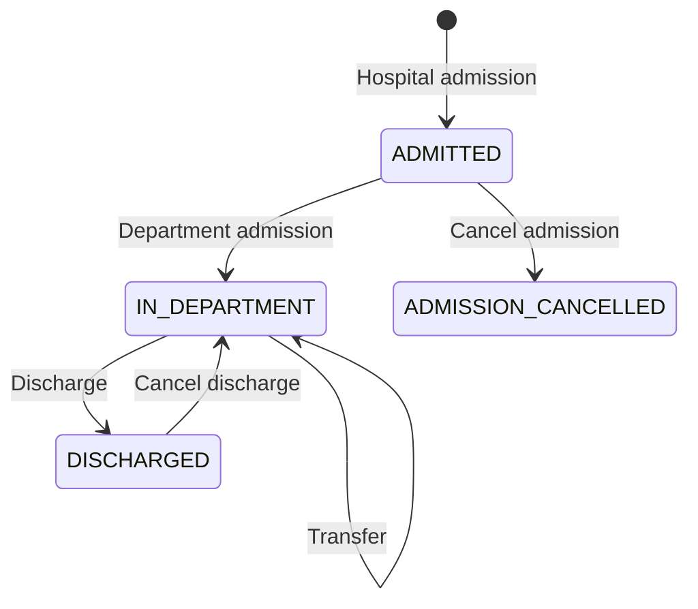

# ClinicFlow API

ClinicFlow is an independent Java backend for inpatient admissions, transfers,
and discharges. It tracks where a patient receives care, whether a bed is
occupied, and how discharge corrections affect that history.

For example, transferring a patient closes the previous location and opens the
next one in a single transaction. Two admissions competing for the same bed
cannot both succeed. Cancelling a mistaken discharge restores care only if the
patient's later encounters and the bed's intervening history allow it.

Built with Java 21, Spring Boot, Spring MVC, Spring Data JPA/Hibernate,
PostgreSQL, and Flyway. H2 supports the local demo and regular tests; JUnit,
Mockito, MockMvc, and Testcontainers cover API and database behaviour.

- [Run the demo](#demo-workflow)
- [Use PostgreSQL](#postgresql)
- [API reference and business rules](docs/api.md)
- [Tests and CI](#tests)

## Workflow



Patient registration precedes hospital admission. Department entry records a
department and ward, with an optional bed. Admission cancellation is allowed only
before any location history exists. A genuine readmission creates a new encounter.

## Run locally

Run commands from the repository root with JDK 21. For the complete walkthrough,
use the [demo profile](#demo-workflow). To start with an empty H2 database on
Windows PowerShell:

```powershell
$env:JAVA_HOME = 'C:\Program Files\Java\jdk-21'
$env:Path = "$env:JAVA_HOME\bin;$env:Path"
.\mvnw.cmd spring-boot:run
```

The API starts on port 8080. By default, it uses an in-memory H2 database that is
cleared on shutdown. Default startup does not load reference data, so location
list queries return empty arrays. Reference-data creation and maintenance
endpoints are not available yet.

### PostgreSQL

The `postgres` profile stores data in PostgreSQL. Flyway applies versioned SQL
migrations on startup; Hibernate validates the schema without creating or dropping
tables. The default H2 configuration and its tests continue to use Hibernate.

With Docker Desktop running, start the local database in the same terminal used
to run the application:

```powershell
$env:DB_PASSWORD = 'choose-a-local-password'
docker compose up -d --wait postgres
.\mvnw.cmd '-Dspring-boot.run.profiles=postgres' spring-boot:run
```

The Compose service binds PostgreSQL to localhost port 5432, creates the
`clinicflow` database and user, and stores data in a named volume. Stop it with
`docker compose stop postgres`; restarting the application or database preserves
the data. The password initializes a new volume; changing the environment variable
does not change the password in an existing database.

An existing PostgreSQL server can be used without Docker. Create an empty database
owned by an application user, then set these variables before starting the profile:

```powershell
$env:DB_URL = 'jdbc:postgresql://localhost:5432/clinicflow'
$env:DB_USERNAME = 'clinicflow'
$env:DB_PASSWORD = 'your-database-password'
.\mvnw.cmd '-Dspring-boot.run.profiles=postgres' spring-boot:run
```

`DB_URL` and `DB_USERNAME` default to the values shown above; `DB_PASSWORD` is
required. Keep actual credentials outside the repository. Use `postgres` and
`demo` separately: the demo dictionary is only loaded into the disposable H2
database. PostgreSQL starts without patient or reference data.

The first migration matches the existing patient-flow entities, including foreign
keys, unique constraints and history indexes. Add a new versioned migration for
later schema changes instead of editing a migration already applied to a database.

### PostgreSQL integration tests

The normal `mvnw.cmd clean verify` command runs the existing H2 and unit tests
without requiring Docker. To also run the PostgreSQL tests, start Docker Desktop
and use the Maven profile:

```powershell
.\mvnw.cmd -Ppostgres-it clean verify
```

Testcontainers starts a disposable PostgreSQL 17 instance. The tests use the
application's `postgres` profile and Flyway migrations, and verify migration
re-entry, discharge cancellation, rollback after SQL has been flushed, and two
admissions competing for one bed. The concurrency test checks PostgreSQL's lock
wait information before allowing the winning transaction to commit.

Without Docker, the same tests can use a dedicated PostgreSQL test database:

```powershell
$env:TEST_DATABASE_URL = 'jdbc:postgresql://localhost:5432/clinicflow_test'
$env:TEST_DATABASE_USERNAME = 'clinicflow_test'
$env:TEST_DATABASE_PASSWORD = 'your-test-database-password'
.\mvnw.cmd -Ppostgres-it clean verify
```

The test user must own the test database or have permission to create schemas.
Each run creates a randomly named `clinicflow_it_...` schema and removes that
schema after the tests. Development tables and the `DB_*` application credentials
are not used. A missing database or unavailable Docker runtime fails this explicit
test run instead of silently skipping the tests. Remove the `TEST_DATABASE_*`
environment variables to return to Testcontainers.

### Continuous integration

The [CI workflow](.github/workflows/ci.yml) runs on every push, on pull requests
targeting `main`, and when started manually from GitHub Actions. It uses Java 21
on Ubuntu and runs the same Maven profile as the local PostgreSQL checks:

```bash
bash ./mvnw --batch-mode --no-transfer-progress -Ppostgres-it clean verify
```

This builds the application and runs both the regular tests and PostgreSQL
integration tests. Testcontainers starts PostgreSQL 17 using the runner's Docker
daemon; no shared database or repository database secrets are required.

Surefire and Failsafe reports are uploaded as the `test-reports` artifact for
seven days, including when tests fail. Open a workflow run in the repository's
Actions tab to inspect its logs and download the reports.

### Demo workflow

To load fictional reference data, stop the application and start it with the
optional `demo` profile in the same JDK 21 terminal:

```powershell
.\mvnw.cmd '-Dspring-boot.run.profiles=demo' spring-boot:run
```

For a packaged application:

```powershell
.\mvnw.cmd clean verify
java -jar target/clinicflow-api-0.0.1-SNAPSHOT.jar --spring.profiles.active=demo
```

The profile loads two departments, two wards, and three beds after Hibernate
creates the H2 tables. Both wards have an active bed numbered `01`; the first ward
also has an inactive bed `02`. The IDs are fixed in `src/main/resources/demo/data.sql`.
No patients or encounters are created at startup. The demo profile uses fictional
sample data and is separate from the PostgreSQL migrations.

With the demo application running, open another PowerShell terminal in the
repository root:

```powershell
powershell.exe -NoProfile -ExecutionPolicy RemoteSigned -File .\scripts\demo-workflow.ps1
# If the application uses another port:
powershell.exe -NoProfile -ExecutionPolicy RemoteSigned -File .\scripts\demo-workflow.ps1 -BaseUrl http://localhost:8081
```

`RemoteSigned` applies only to this process and does not change the saved
PowerShell execution policy.

The script queries reference IDs, registers a fictional patient, cancels an
admission before department entry, then admits the patient again. It enters the
first ward, transfers to the second, discharges, cancels discharge, and discharges
again. It checks bed occupancy and the discharge audit along the way, then prints
the patient/encounter IDs and the final timeline JSON and URL.

A completed run leaves three closed location intervals, two discharge records
(one cancelled), and both active beds free. Each run generates new record numbers
and uses current UTC operation times, so sequential runs can share the same demo
database. Use one run at a time with both demo beds free. If a request fails, the
script stops and earlier successful operations remain available for inspection.
Restarting the application clears all H2 data and reloads only the demo dictionary.

## Implementation

The application is organised by feature under
[`com.jiangyudai.clinicflow`](src/main/java/com/jiangyudai/clinicflow):
`patient`, `encounter`, and `location`. Controllers validate request DTOs,
services coordinate transactions, and repositories perform database queries and
locking. API responses use DTOs with Open EntityManager in View disabled.

| Entity | Responsibility |
| --- | --- |
| `Patient` | Registration details and unique medical record number. |
| `Encounter` | One inpatient stay, its current state, and admission/cancellation times. |
| `EncounterLocation` | A timed department, ward, and optional bed assignment. |
| `EncounterDischarge` | A discharge and its cancellation audit, linking the original and restored locations. |
| `Department`, `Ward`, `Bed` | Reference data used by location workflows; each bed belongs to a ward. |

A patient can have multiple encounters, with at most one active at a time.
Locations and discharge records belong to an encounter. Current bed occupancy
is derived from a location whose `endedAt` is null.

Location changes lock the encounter before the target bed. Admission and
discharge cancellation also lock the patient to coordinate competing encounters.
These checks and their writes share a transaction. PostgreSQL foreign keys,
unique constraints, and history indexes are defined in the
[Flyway migration](src/main/resources/db/migration/postgresql/V1__create_patient_flow_schema.sql).

## Tests

```powershell
.\mvnw.cmd clean verify
.\mvnw.cmd '-Dtest=EncounterTimelineIntegrationTest' test
```

The default build runs unit, controller, and H2 integration tests. Coverage includes
request validation, state transitions, optional beds, backdated operations,
cancellation history, transaction rollback, and concurrent workflow changes.

The [PostgreSQL test profile](#postgresql-integration-tests) adds checks for
Flyway migration re-entry, discharge cancellation and bed restoration, rollback
after SQL has been flushed, and two admissions competing for a bed. These tests
exercise PostgreSQL directly; the broader H2 suite still runs separately within
the same build.

[CI](#continuous-integration) runs both groups with Java 21 and PostgreSQL 17.
Test configuration and expected behaviour are in
[`src/test/java`](src/test/java/com/jiangyudai/clinicflow).

## Current scope

Patient and encounter details are retrieved by ID. Patient search, paginated
inpatient lists, and reference-data maintenance endpoints are not implemented.
Department, ward, and bed lists support filters but currently have no pagination.

Authentication and role-based access are not implemented. Cancellation operators
are supplied by the caller; these fields do not identify an authenticated user.
The timeline contains location and discharge history, not a complete audit of all
system activity.

The project currently covers inpatient flow through REST/JSON APIs. Physician
assignment, outpatient scheduling, clinical orders, billing, and a frontend are
outside the implemented scope. The next business increments are patient lookup
and inpatient lists, followed by authenticated operations.
