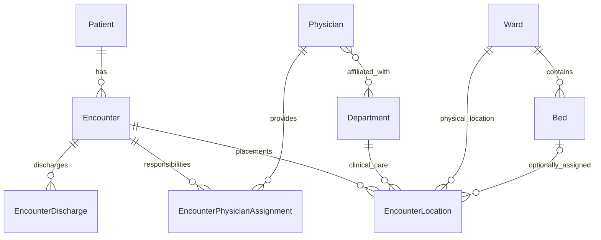

# Architecture and code navigation

ClinicFlow is a feature-organised, layered Spring Boot monolith. One inpatient
encounter is the centre of its workflows: its status, placement history and
physician responsibility must change consistently. Modules share a database and
JPA references; they are not independently deployable services.

## Responsibilities

| Area | Responsibility |
| --- | --- |
| `patient` | Patient registration, identity and patient search. |
| `encounter` | Admission, placement, discharge/corrections, physician responsibility and encounter queries. |
| `location` | Department, ward and bed reference data and availability queries. |
| `physician` | Physician directory, current department affiliations and availability. |
| `security` | Sessions, role checks, persistent accounts and initial provisioning. |
| `web.error` | Translate domain failures to the public API problem contract. |
| `common` | Business-independent time configuration and literal search escaping. |

Controllers validate request DTOs and obtain the authenticated operator. Services
own transaction boundaries, coordinate repositories and check rules involving
other records. Entities protect their own state changes. Repositories define
queries, fetch plans and row locks. PostgreSQL enforces reference integrity and
the documented uniqueness/check constraints.

Controllers must not call repositories. Entities must not depend on controllers,
services or repositories. Business services receive the operator explicitly;
they do not read HTTP requests or a static security context.

The application-service boundary returns response DTOs to controllers, assembled
inside the transaction. Internal reference/locking collaborators may return
entities. Query extraction must retain the existing consistency locks: a query
that takes a PostgreSQL row lock is deliberately not a read-only transaction.

`EncounterService` coordinates writes. `EncounterQueryService` reads encounter
details, patient history, discharge records and the timeline; `InpatientQueryService`
owns the paged worklist projection. Physician responsibility stays in its own
service because it has separate eligibility and effective-history rules. These
are application responsibilities within one module, not separate deployable components.

## Model

One patient can have multiple encounters, but at most one active encounter.
Department and ward represent clinical and physical placement respectively;
they are not modelled as the same hierarchy. A placement may have no bed.
Current occupancy is derived from an open placement, not a second flag on Bed.

Physician/department affiliations use a direct many-to-many relation because
they store current membership only. Responsibility is an association entity
because it records effective times, operators and closure reasons. Shared
reference records are not cascade-deleted. Parent-side history collections are
unnecessary: repositories query histories explicitly and page long encounter lists.

## Transfer transaction

1. Lock the encounter and check status and the caller's expected location ID.
2. Resolve the destination; lock a selected bed before checking occupancy/history.
3. Close responsibility if the clinical department changes.
4. End the old placement and flush its closure before inserting the replacement.
5. Commit the placement and responsibility changes together.

Flush sends SQL; it does not commit. It is needed because Hibernate can execute
inserts before updates, while PostgreSQL checks open-placement unique indexes
immediately. Any later failure still rolls back the whole workflow.

Admission and discharge correction first lock Patient. Placement writes use
Encounter -> Bed; physician selection uses Encounter -> Physician -> Department.
Expected record IDs protect the user's last-seen state after waiting for a lock.
Directory edits additionally use optimistic versions. Database constraints guard
active stays, open placements, occupied beds and open responsibility even when
a write bypasses application checks. They do not enforce every historical rule.

## Extension rules

Put a new operation in the business module that owns its state change. Keep
cross-record validation in the application service and local transitions in the
entity. Add queries separately when their projection/fetching needs differ.
Use an association entity when a relationship gains dates, roles or audit fields.
Preserve transaction boundaries when extracting helpers; do not move one part of
an atomic workflow to an independently committed operation.

Stable machine-readable error codes belong to the HTTP contract; explanatory
messages are for people. Reference lookups may join workflow data for efficient
read projections. For example, BedRepository reads open EncounterLocation rows;
this is an intentional shared-database dependency, not strict module isolation.

## Time and error contracts

`TimeConfiguration` supplies a `Clock` to workflow services and Jakarta request
validation. `clinicflow.time-zone` (`CLINICFLOW_TIME_ZONE`) selects the hospital
time zone and defaults to UTC, independently of the host JVM. Services pass a
reference `OffsetDateTime` into entity transitions; entities do not read the
machine clock. Offset timestamps compare instants, so another UTC offset for the
same instant is valid. Fixed-clock tests cover acceptance at the boundary and
rejection one second later. Birth dates allow today in that zone; admission is
converted to the same zone before comparing its date with the patient's birth
date. The registration form leaves that date check to the server, avoiding a
different result from the browser's clock or time zone.

`ApiExceptionHandler` is an HTTP adapter, outside business-independent `common`.
It maps domain exceptions to status, `code`, `title` and `detail`; security filters
use the same code vocabulary. The workbench branches on `code`, with generic
status/detail fallbacks. It does not parse English explanations to decide whether
to refresh history or change a field. See the [error contract](api.md#error-contract).

## Patient workbench composition

`patients.js` creates the following modules once and passes callbacks between
them. Importing a patient component does not register its event listeners; its
creation/initialization function does.

| Module | Owns |
| --- | --- |
| `patient-list.js` | Search, page state, request cancellation and list rendering. |
| `patient-registration.js` | Registration fields, pending save and validation/recovery feedback. |
| `patient-record.js` | Selected patient, details, encounter history and action dialogs. |
| `patient-admission.js` | Admission form, effective-time input, pending save and recovery. |
| `workbench.js` | HTTP/problem handling and shared presentation helpers. |

The list opens the record through a callback. Registration filters the list by
the saved record number. The record supplies its selected patient ID to admission;
a successful admission refreshes encounter history. The inpatient page uses the
same record entry point. Abort controllers and response identity checks prevent
old reads from replacing newer selections. Pending-write guards and explicit
refresh after an uncertain result remain local to the responsible form.

## Verification and reading order

Read EncounterController, EncounterService, EncounterLocation and the V7 migration
alongside PostgresInpatientIntegrityIT's flushed-transfer rollback scenario.
Then read Physician, EncounterPhysicianAssignment and EncounterPhysicianService
alongside PostgresWorkflowIT's competing-selection and eligibility tests.
For reads, follow EncounterQueryService and InpatientQueryService to their
repository projections and PostgresQueryPlansIT.

Unit tests cover local rules; MVC tests cover HTTP/role contracts; PostgreSQL
integration tests exercise real constraints, migration and lock waits; Playwright
exercises the workbench including stale forms and lost write responses. H2 does
not install PostgreSQL partial indexes and cannot replace that database suite.

[ArchitectureTest](../src/test/java/com/jiangyudai/clinicflow/architecture/ArchitectureTest.java)
uses the [ArchUnit core API](https://www.archunit.org/userguide/html/000_Index.html)
as a test-only dependency. It guards controller/persistence separation, service/HTTP
separation, entity dependencies, business-independent common code, explicit clocks,
and DTO fields (including collection elements) that must not expose JPA entities.
It intentionally does not impose acyclic feature modules: shared reference entities
and the documented occupancy query cross those module boundaries.

See [data integrity](data-integrity.md), [responsibility rules](physician-assignments.md),
[query measurements](query-performance.md) and [browser regressions](../e2e/README.md).
The [interview walkthrough](interview-walkthrough.md) connects these files to a
short demonstration and the tradeoffs worth explaining.
